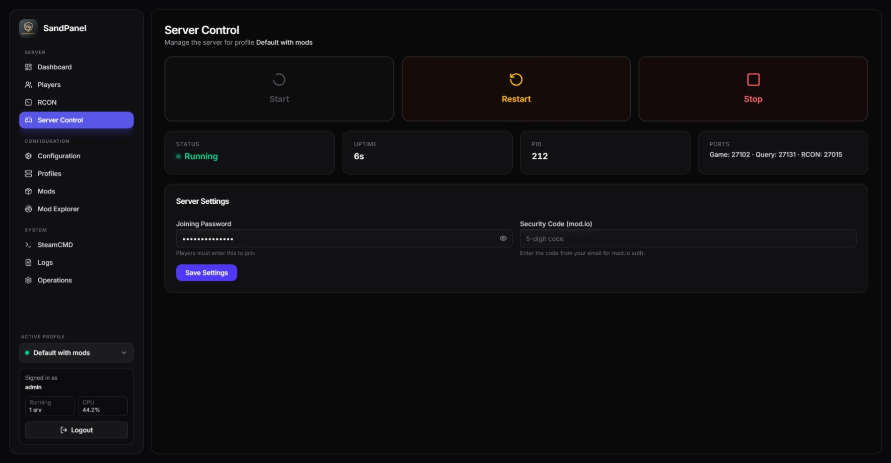
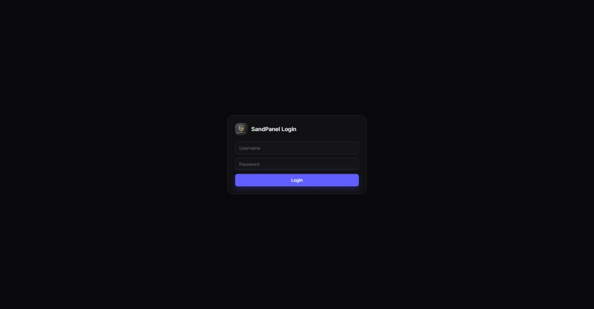
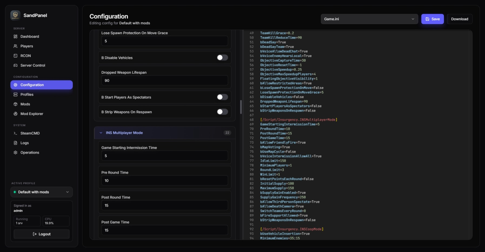
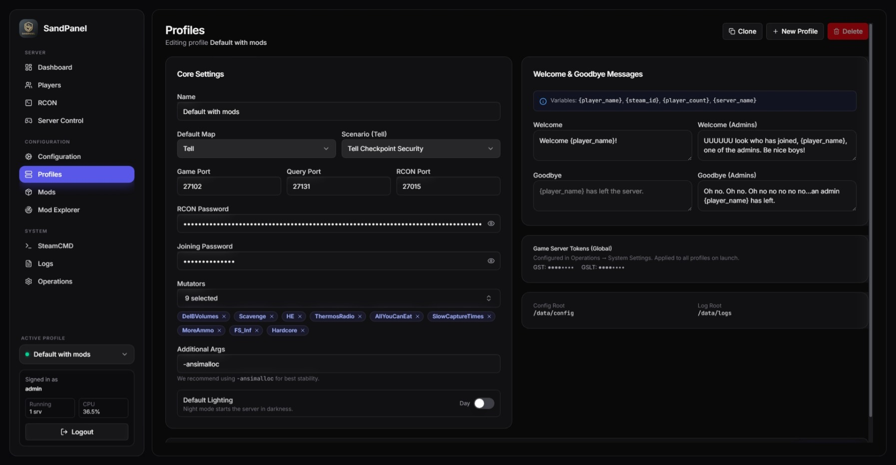
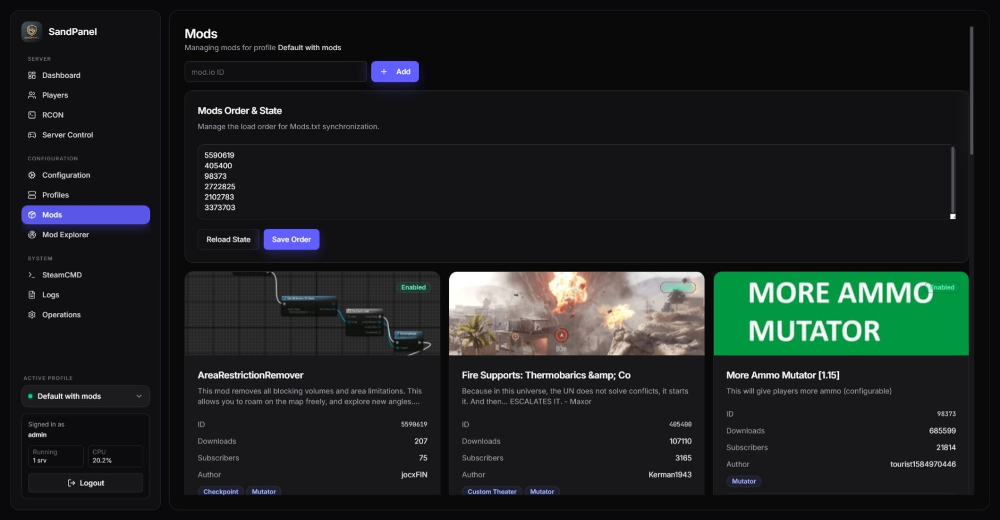
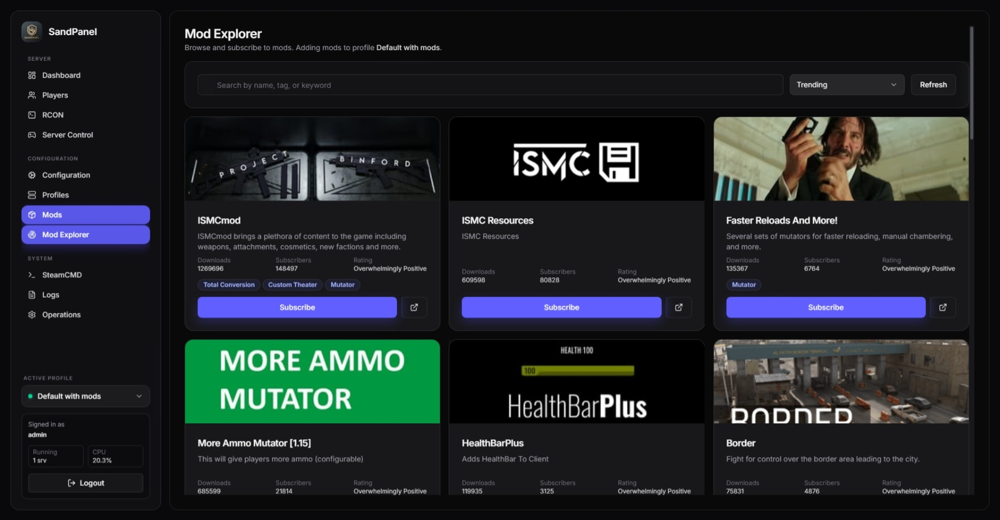

# SandPanel

A self-hosted web panel for managing Insurgency: Sandstorm dedicated servers. Built with Go and React.



## What it does

SandPanel gives you full control over your Sandstorm server from a browser — starting and stopping the server, editing configs, managing mods, monitoring players, and more. Everything runs in Docker, state is stored as JSON files (no database needed), and the whole thing is designed to run on the same machine as your game server.

### Features

- **Server lifecycle** — start, stop, restart with process monitoring
- **Config editor** — visual forms with INI parsing, plus a raw editor toggle
- **Mod management** — subscribe/unsubscribe mods, reorder load order
- **Mod.io auth** — 1.20 security code flow for mod downloads
- **SteamCMD** — install, update, and validate game files
- **RCON console** — send commands, see chat, view player list
- **Live logs** — real-time log streaming over WebSocket
- **Multi-profile** — run multiple server configs with isolated ports
- **Remote monitoring** — A2S query + RCON for checking server status
- **Player tracking** — persistent history with SteamIDs, names, scores
- **User accounts** — role-based access (user / moderator / admin / host)
- **Moderation** — kick, ban, unban from the web UI

## Screenshots

<details>
<summary>Login</summary>


</details>

<details>
<summary>Configuration Editor</summary>


</details>

<details>
<summary>Profiles</summary>


</details>

<details>
<summary>Mod Management</summary>


</details>

<details>
<summary>Mod Explorer</summary>


</details>

## Quick Start

```bash
git clone https://github.com/jocxFIN/sandpanel.git
cd sandpanel
cp .env.example .env
# edit .env — set your RCON password, ports, install path
docker compose up --build -d
```

Open `http://localhost:22369` in your browser. The default admin password is printed to the backend logs on first run:

```bash
docker logs sandpanel-backend 2>&1 | grep password
```

## Configuration

Copy `.env.example` to `.env` and adjust:

| Variable | Default | Description |
|----------|---------|-------------|
| `FRONTEND_PORT` | `22369` | Web UI port |
| `GAME_PORT` | `27102` | Game server port |
| `QUERY_PORT` | `27131` | A2S query port |
| `RCON_PORT` | `27015` | RCON port |
| `RCON_PASSWORD` | — | RCON password |
| `SANDSTORM_INSTALL_PATH` | `./sandstorm-install` | Path to game server files |
| `PUID` / `PGID` | `1000` | Container user/group IDs |

Game server config files live in `configs/` (Engine.ini, Game.ini, MapCycle.txt, etc). The panel also provides a visual editor for these.

## Architecture

```
┌─────────────────────────────────────────────────┐
│  Host                                           │
│                                                 │
│  ┌───────────────────┐  ┌────────────────────┐  │
│  │ sandpanel-frontend │  │ sandpanel-backend  │  │
│  │ Vite + React      │  │ Go 1.22            │  │
│  │ :22369 (web UI)   │──│ :8080 (internal)   │  │
│  │                   │  │                    │  │
│  │ SPA with proxy    │  │ Process wrapper    │  │
│  │ Dynamic forms     │  │ RCON client        │  │
│  │                   │  │ INI AST parser     │  │
│  └───────────────────┘  │ A2S query          │  │
│                         │ WebSocket logs     │  │
│                         │ SteamCMD lifecycle  │  │
│                         └────────┬───────────┘  │
│                                  │              │
│                         ┌────────▼───────────┐  │
│                         │ Sandstorm Server   │  │
│                         │ :27102 Game        │  │
│                         │ :27131 Query       │  │
│                         │ :27015 RCON        │  │
│                         └────────────────────┘  │
└─────────────────────────────────────────────────┘
```

## Mod.io Authentication (1.20+)

Sandstorm 1.20 moved mod downloads to mod.io. Use the **Mod.io** page in the panel to complete the one-time auth:

1. Enter your email — a security code is sent
2. Enter the code — the backend boots once with `-SecurityCode=<CODE>`
3. Future launches use the stored OAuth token from `data/steam-home/mod.io/`

## Development

**Prerequisites:** Go 1.22+, Node.js 22+, Docker

**Backend:**
```bash
cd backend-go
go build -o sandpanel-backend ./cmd/server
./sandpanel-backend
```

**Frontend:**
```bash
cd sandpanel-web
npm install
npm run dev
```

**Full stack:**
```bash
docker compose up --build
```

## CI / Docker Hub

Two GitHub Actions workflows are included:

- `ci.yml` — runs tests, builds, and validates Docker images on PRs and pushes to `main`
- `docker-publish.yml` — publishes images to Docker Hub on tags and pushes to `main`

Set `DOCKERHUB_USERNAME` and `DOCKERHUB_TOKEN` as repository secrets to enable publishing.

You can also use pre-built images instead of building locally:

```bash
BACKEND_IMAGE=<namespace>/sandpanel-backend:latest \
FRONTEND_IMAGE=<namespace>/sandpanel-frontend:latest \
docker compose up -d
```

## Third-party

This project uses the following third-party software and services:

- **[SteamCMD](https://developer.valvesoftware.com/wiki/SteamCMD)** — Valve's command-line tool for installing and updating dedicated servers. SteamCMD is bundled in the Docker image via `cm2network/steamcmd`. SteamCMD is a product of Valve Corporation.
- **[mod.io](https://mod.io/)** — Mod hosting platform. SandPanel integrates with the mod.io API for mod management. The `defaultEmailRequestAPIKey` used for authentication is mod.io's standard public API key for server-side email auth flows.
- **Source RCON Protocol** — The RCON client implements Valve's [Source RCON Protocol](https://developer.valvesoftware.com/wiki/Source_RCON_Protocol) for server communication.
- **Insurgency: Sandstorm** — This project is not affiliated with or endorsed by New World Interactive or Focus Entertainment. Insurgency: Sandstorm is a trademark of its respective owners.

## License

[MIT](LICENSE)
